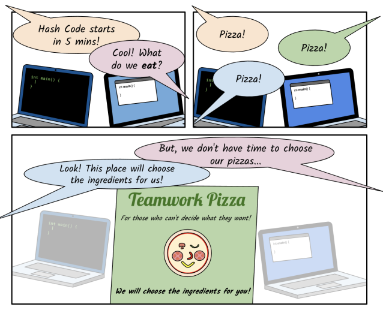
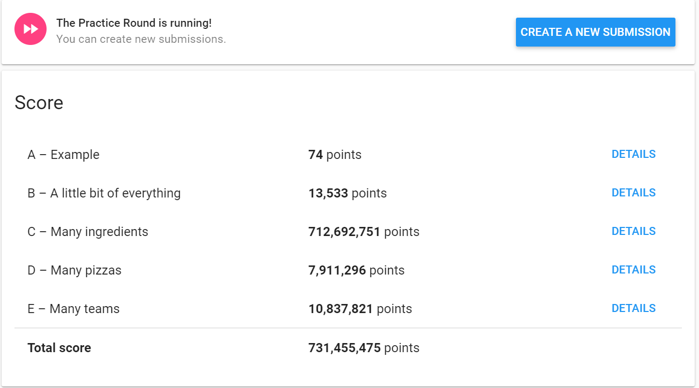
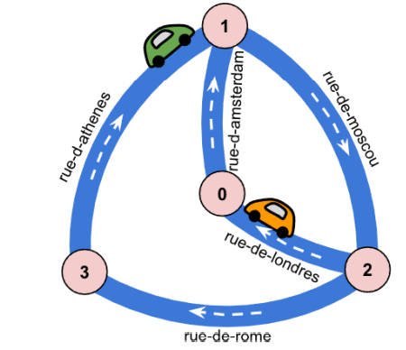
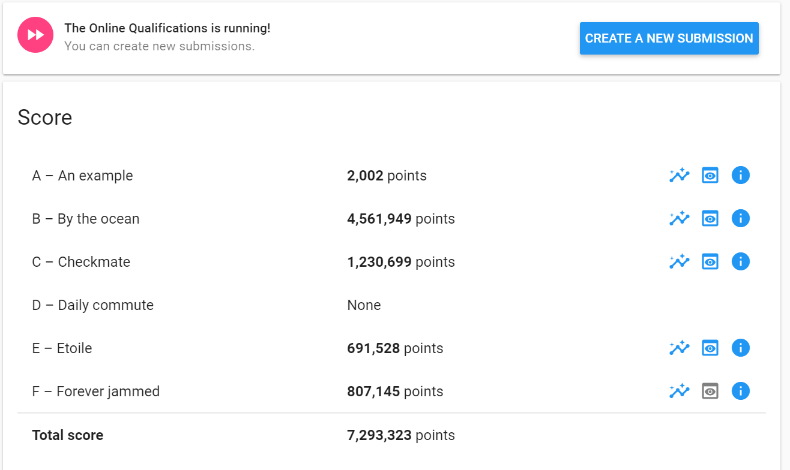

# HashCode2021

### Team Members :
- [Krutika Bhatt](https://github.com/KrutikaBhatt/) 
- [Bhushan Patil](https://github.com/Bhushan258) 
- [Aayush Chheda](https://github.com/Aayush-Chheda)

## Even More Pizza 🍕
### Solution for the Practice Round of Google Hash Code 2021 - Score: 731,455,475

Before going for the algorithm, read the <a href="EvenMorePizza/practice_round_2021.pdf">Practice Problem</a>
 

## Solution
1. Sort the pizzas by the number of ingredients
2. Build the deliveries - first for 4 team members ,then 3 team members and then 2
3. Select the pizza with most number of ingredients (To get more score)
4. Select the pizzas with more unique ingredients and less overlapping ingredients
5. Until delivery is ready, repeat the Steps 2-4
6. Try to swap 2 pizzas between 2 delivery, if it increases score Swap
7. Try to swap pizzas between once in deliveries with unused Pizzas ; If score increases swap
8 . Try to move 1 pizzas between all 2 member's team to see if it increases score

## Result 

  

## Qualification Round
> This code is not the perfect and it can be optimized and bugs fixed in the future.

### Understanding the Problem Statement : 
Read the Problem statement <a href = "Qualification%20Round/hashcode_2021_online_qualifications.pdf">here</a> 
The problem consist of a city plan with planned paths for all the cars in a city. We need to optimize the scheduling of traffic lights
| Minimize the total amount of time spent in traffic |
| :-------------------------------------------------:|
| Maximum number of cars should reach to end         |
  
 
The city plan consists of one-way streets and intersections. Each intersection( Road Node) is identified by Integer Id
Each Street consist of a Name,starting Node ,Ending Node and total time taken to complete the Street

There is a traffic light at the end of each street. When the light is green, one car can cross the intersection
every second. This means that if a green light for a given street lasts for Ti seconds then only the  Ti cars from that street can travel
Moreover ,The traffic light schedule determines the order and duration of green light for the incoming streets of the
intersection and repeats itself until the end of the simulation. The schedule is a list
of pairs: incoming street and duration.

### Algorithm followed :

### Result :

